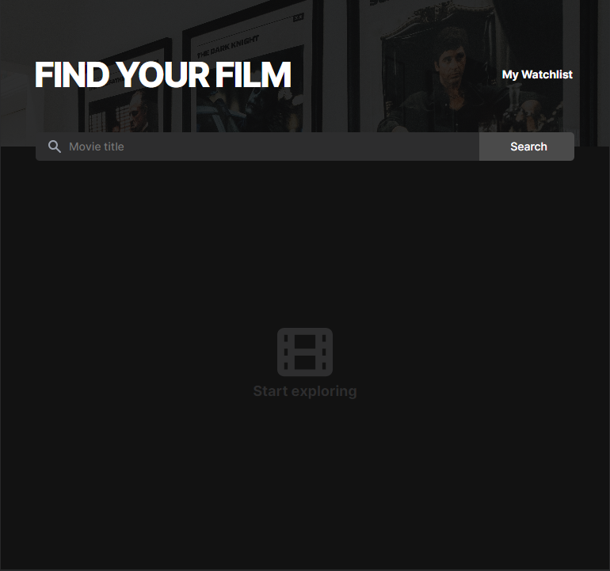
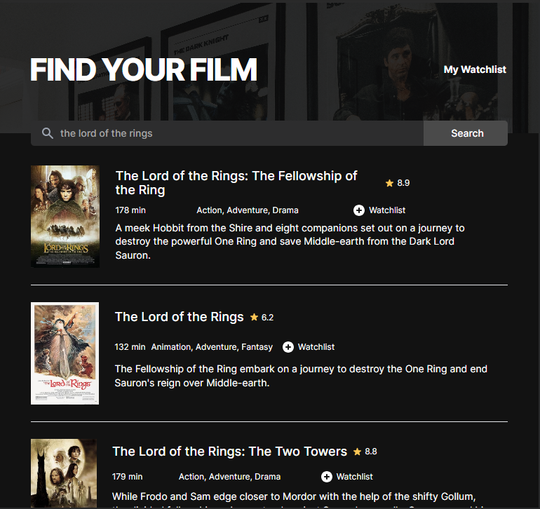
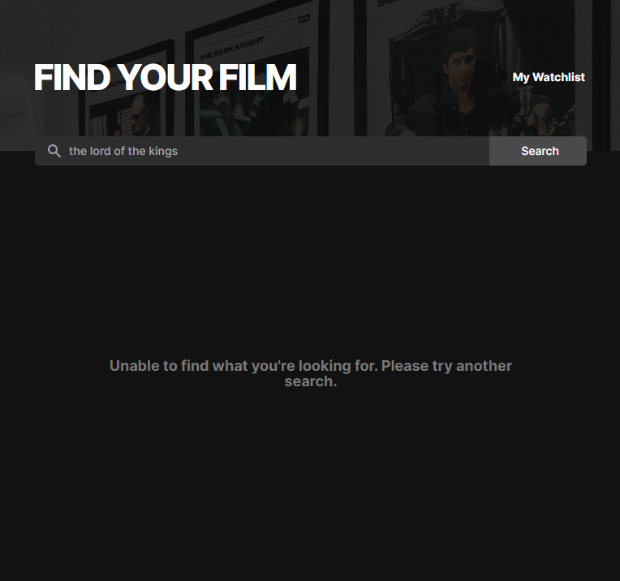
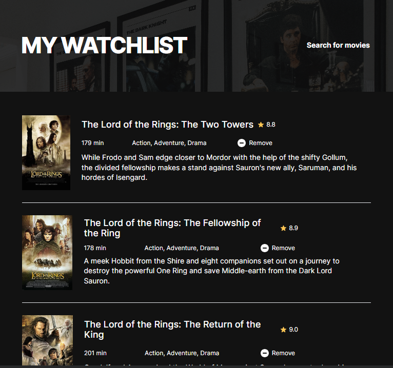
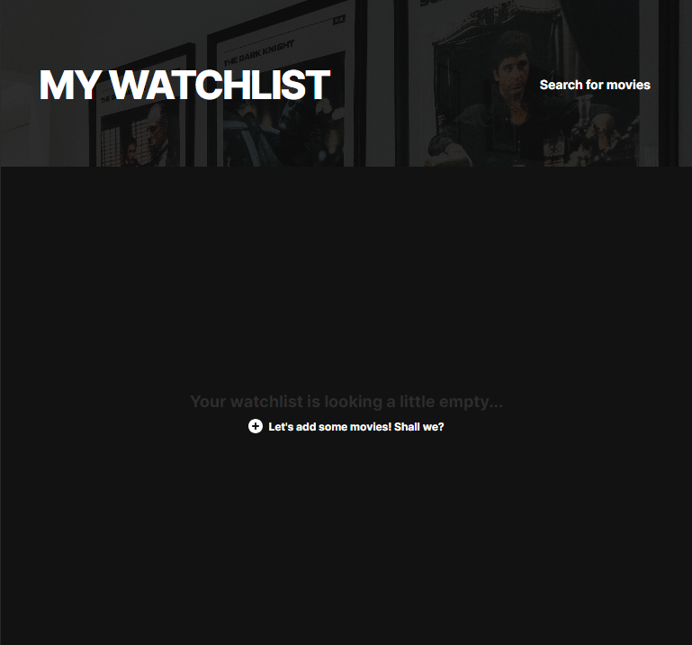

# Scrimba - The Frontend Developer Carrer Path - Module 8 - Movie Watchlist web application project

Hello and welcome! Thank you for stopping by.🤠

This is a solution to Movie Watchlist web application project from _Module 8 - Working with APIs_ of the [The Frontend Career Path](https://scrimba.com/learn/frontend).

## Table of contents

- [Overview](#overview)
  - [The project](#the-challenge)
  - [Screenshot](#screenshot)
  - [Links](#links)
- [My process](#my-process)
  - [Built with](#built-with)
  - [What I learned](#what-i-learned)
  - [Continued development](#continued-development)
- [Author](#author)
- [Acknowledgments](#acknowledgments)
- [About Scrimba](#about-scrimba)

## Overview

### The project

Movie Watchlist web app allows users to do following:

- Search for movies from database
- Add favourite movies into their Watchlist
- Save their Watchlist on the local storage
- Remove movies from the Watchlist

### Screenshot

Default

Searching

Watchlist

### Links

- Solution URL: [Github Repository](https://github.com/PetrValenta92/movie-watchlist)
- Live Site URL: [Github Pages](https://petrvalenta92.github.io/movie-watchlist/)

## My process

### Built with

- Semantic HTML5 markup
- CSS custom properties
- BEM
- Dark theme design
- Flexbox and GRID
- Mobile first design
- Accessibility focus design
- Responsive design
- free API
- Fetch, Async/await

### What I learned

Above all, I learned to work with the [phind AI](https://www.phind.com/), which was a great tool for me. It helped me a lot and always managed to direct me correctly, or even evaluate and complete my code. My work was suddenly much more efficient and faster. The key was only in learning how to ask a proper question. Next I practiced working with API and async / await funstions. For this I learned how to use try...catch statements.

### Continued development

**The most important thing is to treat and hide the API key in the future!** Also I would like to add some new features e.g. render the watchlist in the same order, or to make the "add" and "remove" buttons change so that the user can add and remove movies directly on the home page.

## Author

- Website - _to be added..._
- GitHub - [@PetrValenta92](https://github.com/PetrValenta92)
- LinkedIn - [@valentapetr](https://www.linkedin.com/in/valentapetr/)
- Instagram - [@petr_thedev](https://www.instagram.com/petr_thedev/)

## Acknowledgments

I would love to thank whole [Scrimba](https://scrimba.com) team for such amazing project they have prepared.
I want to thank the Scrimba community and my beloved [Junior Guru Community](https://junior.guru/) community! 🐣

Photo by <a href="https://unsplash.com/@andredantan19?utm_content=creditCopyText&utm_medium=referral&utm_source=unsplash">Andre Tan</a> on <a href="https://unsplash.com/photos/black-and-white-photo-frame-on-white-wall-THJJRUhNlEc?utm_content=creditCopyText&utm_medium=referral&utm_source=unsplash">Unsplash</a>

## About Scrimba

At Scrimba our goal is to create the best possible coding school at the cost of a gym membership! 💜
If we succeed with this, it will give anyone who wants to become a software developer a realistic shot at succeeding, regardless of where they live and the size of their wallets 🎉
The Frontend Developer Career Path aims to teach you everything you need to become a Junior Developer, or you could take a deep-dive with one of our advanced courses 🚀

- [Our courses](https://scrimba.com/allcourses)
- [The Frontend Career Path](https://scrimba.com/learn/frontend)
- [Become a Scrimba Pro member](https://scrimba.com/pricing)

Happy Coding!
